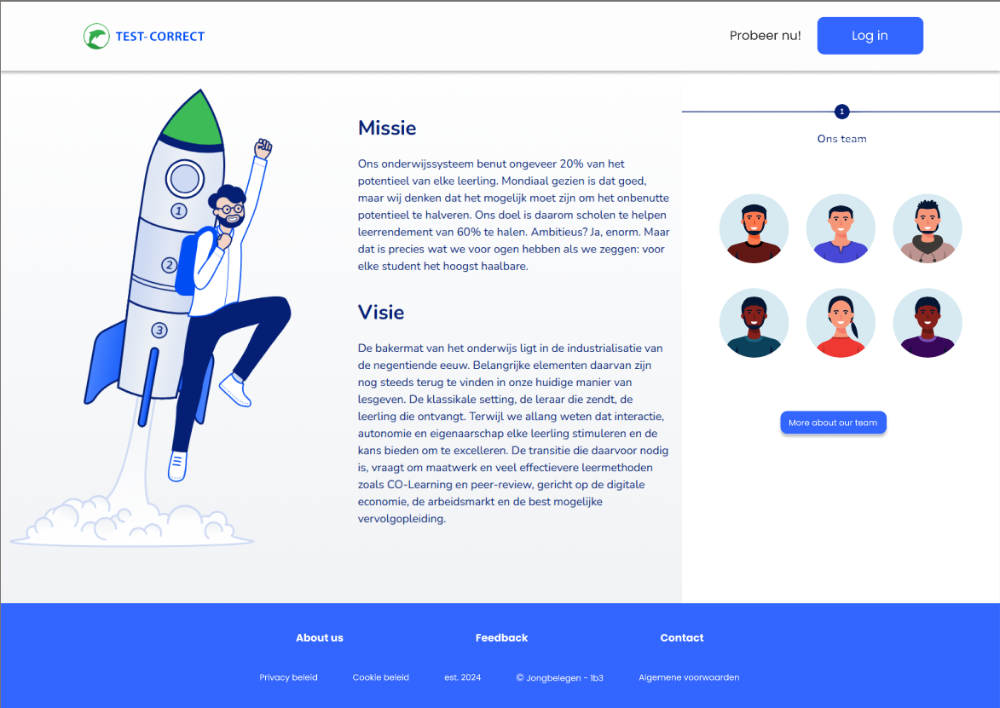
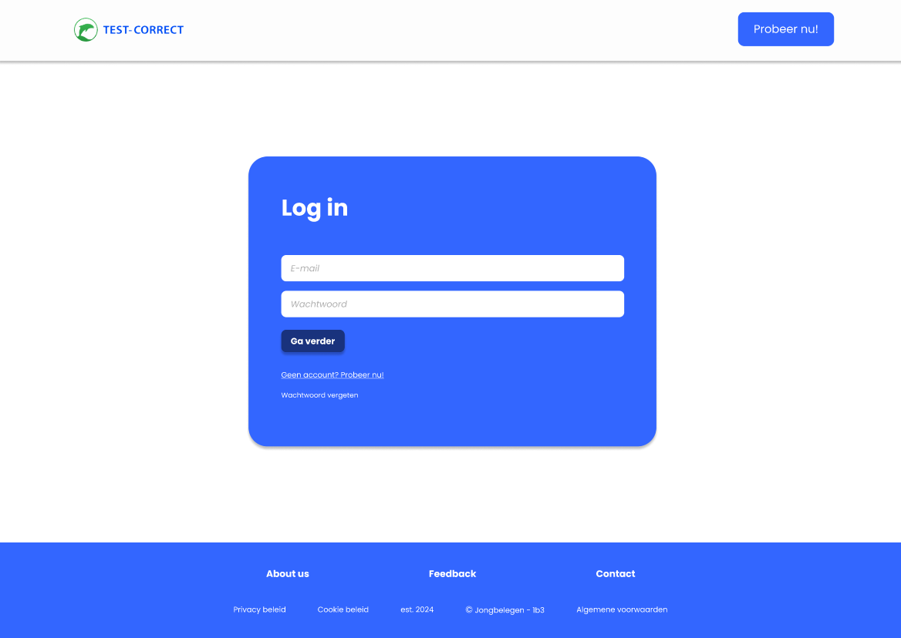
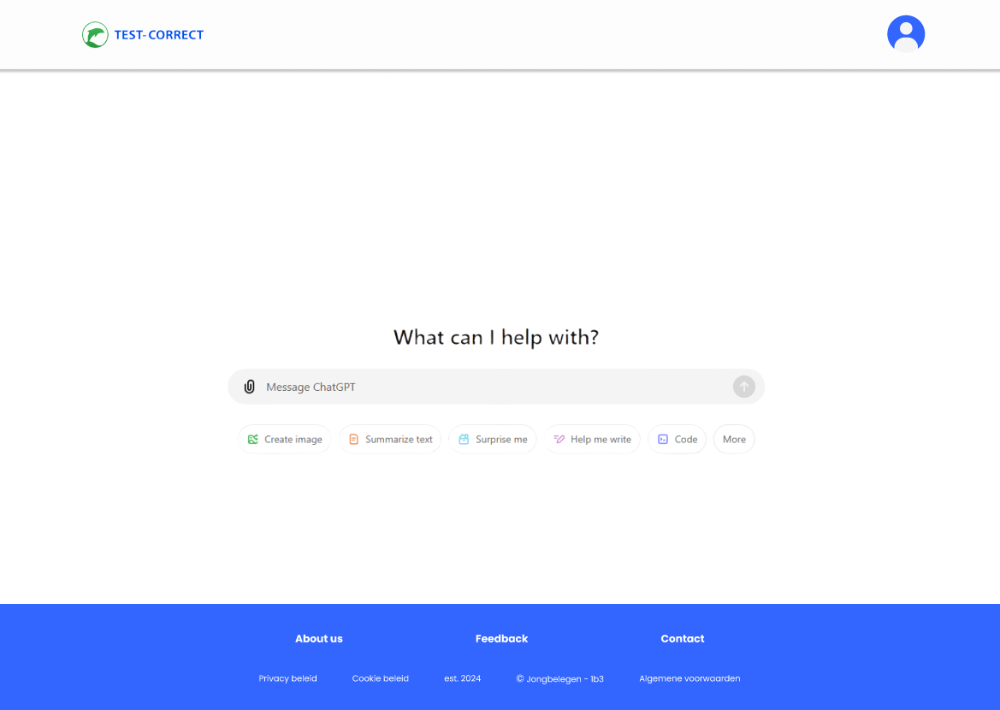

# WP2 1B3

Before starting the application make sure you have done the following things:
- created a venv with python version 3.12.
- installed alle of the requirements in the requirements.txt file

Maak eerst een venv aan:
```
python -m venv .venv
```
Activeer deze met:
```
.venv\Scripts\activate
```

If you haven't done this yet run this.
```
pip install -r requirements.txt
```

If you have installed everything and made a venv use this to boot up the application.
```
python app.py
```


**Application walk through:**

In order to start up the application you open the app.py file inside the project.
Make sure you either have it set to run current file or have it set to run app.py.
Once the application has started up, press the link in the terminal to go to the website.

When you have done this you should end up on the login page
and shouldn't be able to go to other pages meant to be accessed by actual users.
Use the following information to login

admin rights account:
email: krugw@hr.nl
password: geheim

non admin rights account: 
email: vried@hr.nl
password: geheimer

After logging in you should be redirected to the homepage,
if you used the admin account then should be a button called redacteuren visible in the top right of the screen.
The button will send you to the menu's to change, add, remove, or update details of other users.

To view the pages on the site use the navbar.
For example the options prompts,
There should be a main menu visible showing the prompts that are in the database.
if there is none the table isn't visible, meaning you will need to add a prompt your self.
Use the following prompts as examples.

Prompt for the taxonomy of bloom:

prompt name: default bloom prompt
prompt type: bloom
prompt: Gebruik de taxonomie van Bloom om de volgende vraag in één van de niveaus "Onthouden", "Begrijpen", "Toepassen", "Analyseren", "Evalueren" en "Creëren" en leg uit waarom je dat niveau hebt gekozen. Geef het antwoord in een RFC8259 JSON met de volgende opmaak:
    {
       "niveau": "niveau van Bloom",
       "uitleg": "uitleg waarom dit niveau van toepassing is"
    }

Prompt for the taxonomy RTTI:

prompt name: default RTTI prompt
prompt type: RTTI
prompt: Gebruik het RTTI-model om de volgende vraag in één van de niveaus "Reproductie", "Toepassing", "Inzicht" en "Transfer" te plaatsen en leg uit waarom je dat niveau hebt gekozen. Geef het antwoord in een RFC8259 JSON met de volgende opmaak:

{
   "niveau": "niveau van RTTI",
   "uitleg": "uitleg waarom dit niveau van toepassing is"
}

If you would like to test out the filters on the page make a few prompts with a few letters of the alphabet,
or make a updated version of the working prompt.
The filter feature is one of my favorites this is because i had to come up with a way to make the query's adjustable.
The update feature required me to come up with a way to take the information and insert it in to the input fields.


If you would like to update a prompt simply go to the prompt page,
hit the details button for a prompt of which you would like to details and then hit the update button.

if you made a mistake or would like to delete a prompt simply hit the delete button instead, confirm your intend and then go back to the show prompts page
and the prompt you wanted to delete is gone.


If you would like to index a few questions make sure there are questions to index.
If there arent any questions at all hit the import button on the questions page.
You should now be on a page where you can select a file to import, select the json file and then hit the import button.
after this a flash message should show up telling you if it was a succes or not.
If it was a succes you can go back to the questions page
and use the filters to sort questions based of a search term, education level (havo) and
school year.

The buttons on the page behind the questions are only visible if there is no index available in the database.
hitting one of these buttons sends you to the index pages which will start the proces for indexing a question.

Based of the indexing system you're using the prompts displayed in the dropdown selection menu should change,
if you are indexing for bloom for example it should only show prompts marked for use to index bloom.
This feature was made with the idea in mind that the owner might want to expand from indexing using one or two systems to more.
I am proud of how the feature works and was made with the idea of allowing for easy expansion.

There is no automatic reload function for if the api returns a answer that cant be used.
So if this happens reload the page.

If there is an answer that makes sense or is usable make sure to select an option in the drop-down menu,
if you agree with the api select the same thing as the api, if you disagree select what you think it should be.

After that submit the answer and check the prompt page again, the info there should now be updated to display a higher number of indexed questions,
as well as a higher or lower rating based of if it was a good or bad answer for the api.

It is also possible to contact us, if you go to the contact page, fill in the necessary info/details and click on submit we receive it in our email account.

On the About Us page you can find more details about our team and find our social media pages.

It is also possible to import questions, go to the questions page (Vraagbank) and click on the 'importeer toetsvragen'. It will lead to a new page where you can upload a file and it will be saved into the database.

On the bottom of the questions page there is also a export button, simply click on it and it will directly open the export page, here you can select a question and download it as a JSON file.

We tried to set user data to 'NULL' except for the user_id and login when an admin user tries to delete him or herself, sadly this did not work because the database is locked. I've put a '#' at the beginning of line 58 in app.py where this function was previously called.

There is a page where you can see all the questions indexed by a certain user, when you go to redacteuren page and click on the 'vragen' button.


designs:






BRONNENLIJST
- Creemers, L. (2023, December 31). Build a To-Do list app using Python Flask, Jinja2, and SQL. Lou’s Blog Exploring Tech. Geraadpleegd op 30 november 2024, van https://lovelacecoding.hashnode.dev/build-a-to-do-list-app-using-python-flask-jinja2-and-sql
- W3Schools.com. (z.d.). HTML Tutorial. Geraadpleegd op 3 december 2024, van https://www.w3schools.com/html/
- Stackoverflow. Connect Database using Python: https://stackoverflow.com/questions/62340498/open-database-files-db-using-python
- GeeksForGeeks. Connect Database using Python: https://www.geeksforgeeks.org/python-sqlite-connecting-to-database/
- Pytutorial. Send file using Flask: https://pytutorial.com/flask-send_file-efficiently-send-files-to-clients/
- GeeksForGeeks. Send file as JSON export: https://www.geeksforgeeks.org/reading-and-writing-json-to-a-file-in-python/
- W3Schools. Hover effect in CSS: https://www.w3schools.com/CSSref/sel_hover.php#:~:text=The%20CSS%20%3Ahover%20pseudo-class%20is%20used%20to%20select,pages%2C%20and%20%3Aactive%20to%20style%20the%20active%20link.
- W3Schools. <a> href Attribute HTML used for linking (web)pages to buttons and icons:https://www.w3schools.com/tags/att_a_href.asp
- GeeksForGeeks. Session Object in Python: https://www.geeksforgeeks.org/session-objects-python-requests/
- GeeksForGeeks. Retrieve HTML form data with Flask:https://www.geeksforgeeks.org/retrieving-html-from-data-using-flask/

Bron voor "volgende" en "vorige" knoppen in tabel:
https://www.w3schools.com/howto/howto_css_next_prev.asp

BUGS:
-On the export page the questions list is half outside the screen. It gets pushed to the right, multiple solutions have been tried.